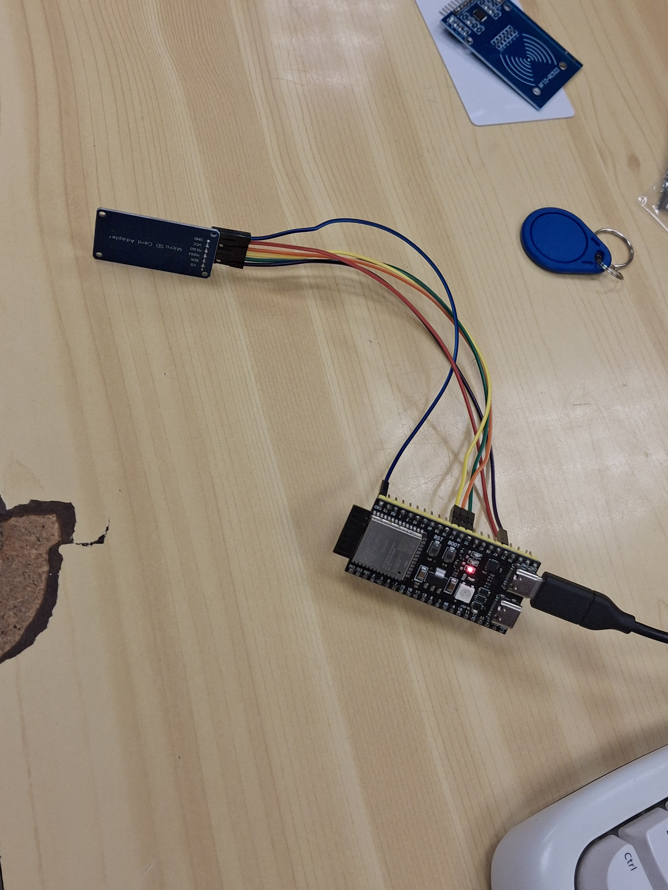
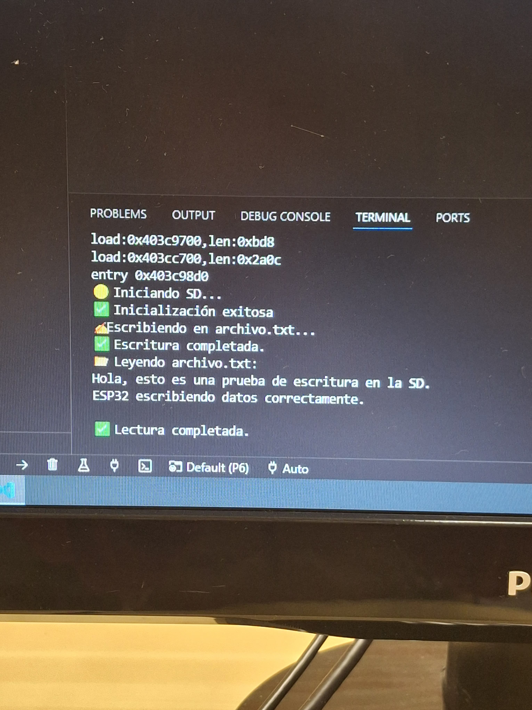
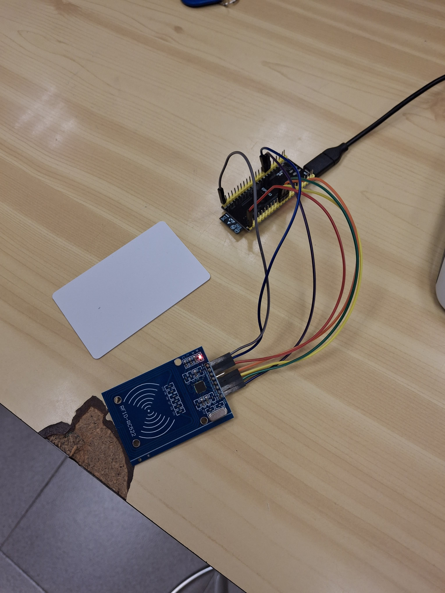
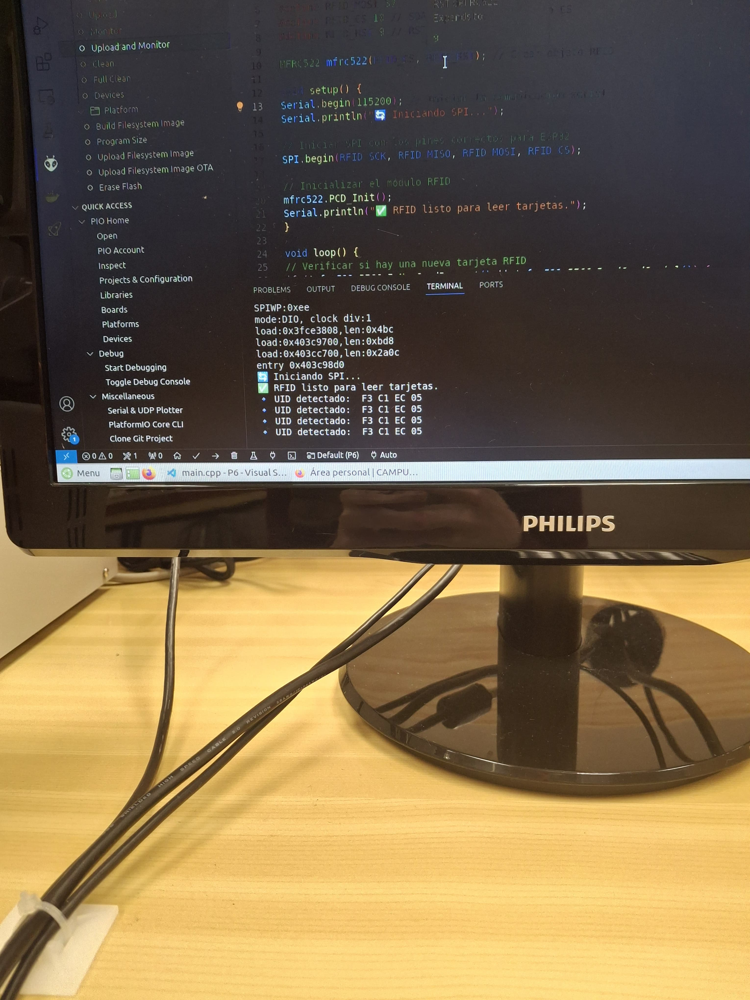

Sandra Cots

**Informe de la Práctica 6: Buses de Comunicación II (SPI)**

**Introducción**

El objetivo de esta práctica es comprender el funcionamiento del bus **SPI (Serial Peripheral Interface)**, un protocolo de comunicación sincrónico utilizado para conectar dispositivos periféricos con microcontroladores. Se realizaron dos ejercicios principales:

1. **Ejercicio Práctico 1**: Lectura/Escritura de una tarjeta **SD** mediante SPI.
1. **Ejercicio Práctico 2**: Lectura de etiquetas **RFID** utilizando un módulo **RC522**.

**Ejercicio Práctico 1: Lectura/Escritura de Memoria SD**

**Descripción**

Este ejercicio consiste en leer y escribir datos en una tarjeta SD utilizando el bus SPI. El código utiliza las bibliotecas SPI.h y SD.h para interactuar con la tarjeta.

**Código**

#include <Arduino.h>

#include <SPI.h>

#include <SD.h>

File myFile;

// Definir pines SPI (ajustados a ESP32)

#define SD\_SCK  35

#define SD\_MISO 36

#define SD\_MOSI 37

#define SD\_CS   21 // Pin CS

void setup() {

`  `Serial.begin(115200);

`  `Serial.println("🟡 Iniciando SD...");

`  `// Inicializar SPI con los pines correctos

`  `SPI.begin(SD\_SCK, SD\_MISO, SD\_MOSI, SD\_CS);

`  `// Iniciar SD

`  `if (!SD.begin(SD\_CS, SPI)) {  

`    `Serial.println("❌ No se pudo inicializar la SD.");

`    `return;

`  `}

`  `Serial.println("✅ Inicialización exitosa");

`  `// ---- ESCRITURA ----

`  `Serial.println("✍️ Escribiendo en archivo.txt...");

`  `myFile = SD.open("/archivo.txt", FILE\_WRITE);

`  `if (myFile) {

`    `myFile.println("Hola, esto es una prueba de escritura en la SD.");

`    `myFile.println("ESP32 escribiendo datos correctamente.");

`    `myFile.close();

`    `Serial.println("✅ Escritura completada.");

`  `} else {

`    `Serial.println("⚠️ Error al abrir el archivo para escritura.");

`    `return;

`  `}

`  `// ---- LECTURA ----

`  `Serial.println("📂 Leyendo archivo.txt:");

`  `myFile = SD.open("/archivo.txt");

`  `if (myFile) {

`    `while (myFile.available()) {

`      `Serial.write(myFile.read());

`    `}

`    `myFile.close();

`    `Serial.println("\n✅ Lectura completada.");

`  `} else {

`    `Serial.println("⚠️ Error al abrir el archivo para lectura.");

`  `}

}

void loop() {

`  `// No se necesita código en loop

}

**Salida Esperada**

**Circuito Montado SD**

**Código SD**

**Ejercicio Práctico 2: Lectura de Etiquetas RFID**

**Descripción**

Este ejercicio utiliza un módulo **RC522** para leer el **UID** de tarjetas RFID mediante SPI. Se emplea la biblioteca MFRC522.h.

**Código**

#include <SPI.h>

#include <MFRC522.h>

// Definir los pines para el RFID en ESP32

#define RFID\_SCK  35

#define RFID\_MISO 36

#define RFID\_MOSI 37

#define RFID\_CS   10  // SDA del RC522 como CS

#define RFID\_RST  9   // RST del RC522

MFRC522 mfrc522(RFID\_CS, RFID\_RST);

void setup() {

`  `Serial.begin(115200);

`  `Serial.println("🔄 Iniciando SPI...");

`  `// Inicializar SPI con los pines correctos

`  `SPI.begin(RFID\_SCK, RFID\_MISO, RFID\_MOSI, RFID\_CS);

`  `// Inicializar el módulo RFID

`  `mfrc522.PCD\_Init();

`  `Serial.println("✅ RFID listo para leer tarjetas.");

}

void loop() {

`  `if (!mfrc522.PICC\_IsNewCardPresent() || !mfrc522.PICC\_ReadCardSerial()) {

`    `return;

`  `}

`  `Serial.print("🔹 UID detectado: ");

`  `for (byte i = 0; i < mfrc522.uid.size; i++) {

`    `Serial.print(mfrc522.uid.uidByte[i] < 0x10 ? " 0" : " ");

`    `Serial.print(mfrc522.uid.uidByte[i], HEX);

`  `}

`  `Serial.println();

`  `mfrc522.PICC\_HaltA();

}

**Salida Esperada**

**Circuito Montado RFID**

**Código RFID**

**Ejercicio de Subida de Nota: Integración de SD y RFID**

**Descripción**

Se integran ambos ejercicios:

1. **Registro en SD**: Guardar el UID de cada tarjeta RFID en log.txt con marca de tiempo.
1. **Servidor Web**: Mostrar las lecturas en una página web.

**Código** 

#include <SPI.h>

#include <SD.h>

#include <MFRC522.h>

#define RST\_PIN 9

#define SS\_PIN 10

MFRC522 mfrc522(SS\_PIN, RST\_PIN);

void setup() {

`    `Serial.begin(115200);

`    `SPI.begin();

`    `mfrc522.PCD\_Init();

`    `SD.begin(4);

}

void loop() {

`    `if (mfrc522.PICC\_IsNewCardPresent() && mfrc522.PICC\_ReadCardSerial()) {

`        `File logFile = SD.open("/log.txt", FILE\_WRITE);

`        `if (logFile) {

`            `logFile.print("Hora: ");

`            `logFile.print(millis());

`            `logFile.print(" - UID: ");

`            `for (byte i = 0; i < mfrc522.uid.size; i++) {

`                `logFile.print(mfrc522.uid.uidByte[i], HEX);

`            `}

`            `logFile.println();

`            `logFile.close();

`        `}

`        `mfrc522.PICC\_HaltA();

`    `}

}

**Salida Esperada**

**Archivo log.txt**:

Hora: 123456 - UID: 01234567

Hora: 234567 - UID: 89ABCDEF

**Conclusiones**

- **SPI** es un protocolo rápido y eficiente para comunicaciones con tarjetas SD y módulos RFID.
- **Flexibilidad** en la conexión de múltiples dispositivos.
- **Integración** con otros sistemas como almacenamiento en SD y visualización web.

